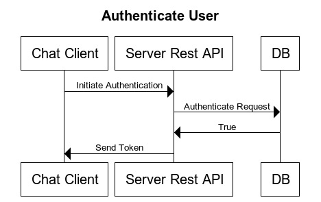
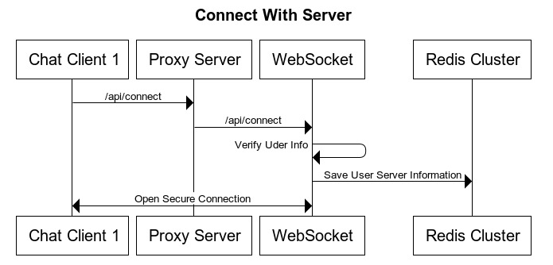
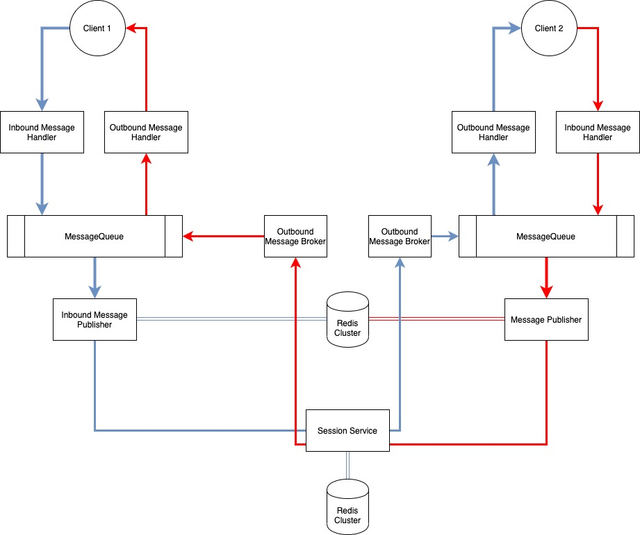

## Problem Statement
* How would you design one-on-one conversations between users?
* How would you extend your design to support group chats?
* What to do when the user is not connected to the internet?
* Delivered and read status?
* When to send push notifications?
* Can you provide end-to-end encryption. How?
* How do you backup and restore the messages when they are end-to-end encrypted?
* How do you build a platform for the community to add bots?
* How do you enable the community to build games in chatrooms?

## Basic Chat Architecture
The standard chat application has two major parts : 
- Chat Server Engine - Server which relay message from one client to other client(s).
- Client App - Application which runs on client device (mobile, desktop etc)


## Chat Server Engine

is a core of the chat architecture that handles message delivery and dispatch. 

- **Rest API Client :** 

  - It handled the tasks that are not connected directly to message dispatch and delivery, such as contact list downling, user authentication, changing of user settings, friends invitation, downloading sticker packs, etc. The Chat App (the chat client part) communicates with the Chat REST API via the **REST API Client Library**.

- **Chat WebSocket Server**

  -  It is responsible for transmitting messages between users. The Chat App communicates with the Chat WebSocket Server via the **Chat WebSocket Client Library**. This connection is open two ways; that means users don’t have to make requests to the server if there are any messages for them, they just get them right away.

- **Chat Media Storage Server** 

  - It is a pool of servers responsible for storing user media files. The files are uploaded to them via the **Chat Media Storage Client Library**.

## Chat App Design
It is the other major part of the chat architecture, the one that users directly interact with. It's split into three separate root components:

- **Chat Client Engine** 
  - It handles all of the communication with the Chat Server Engine via its internal components: Chat REST API Client Library, Chat WebSocket Client Library and Chat Media Storage Client Library. It also comprises the **Chat Push Message Handler** that deals with push notifications.
- **Chat UI** 
  - It displays data to users via its widgets: **Chat Contact List UI**, **Chat Dialog UI**.
- **Chat Device Storage** 
  - It is an internal database which stores messages and files so that users can access them offline. Its internal component, **Chat Cache Reader**, gets media files from the Chat Media Storage and stores them on the device so that the user can access them anytime without having to reach the Chat Media Storage every time.

## Chat Server Engine Design

### Authentication of User




```
var payload = {
  name: '#{customerName}',
  email: '#{customerEmail}',
  phone : '#phone_number',
  iat: #{timestamp},
  sercet_password: '#{sercet_password}'
};
```

Secret Password could be anything which can be used to authenticate user. 

Name, Email and Phone could be optional based on the way you want to authenticate the user. 

The API will return a unique **secret JWT token** which will be used to verify the user. 


### One to One Chat




```
connection_detail {
 string connection_string;
 string user_token;
}
```

Depending on the server availabilty, chat client can connect to any given server.

 



- **InBoundMessageHandler**
  - It handles all the incoming messages from client and push it to the message queue. 
- **InbboundMessagePublisher**
  - In consumes messages from the queue , push it to redis and also inform the subsribers to update the client. 
- **OutBoundMessageSubscriber**
  - Listen to all the published message events and put the message back into the message queue. 
- **OutBoundMessagehandler**
  - Publish the message back to the client.
- **Session Service**
  - Stores all the current connected users and server details.

## Questions and Answer

1. **How would you design one-on-one conversations between users?**

   - As shown in the above diagram.

2. How would you extend your design to support group chats? 

   -  We can have a service Group Chat Service which will give us the list of user associated with the group. 
   - 

   

   

   

    