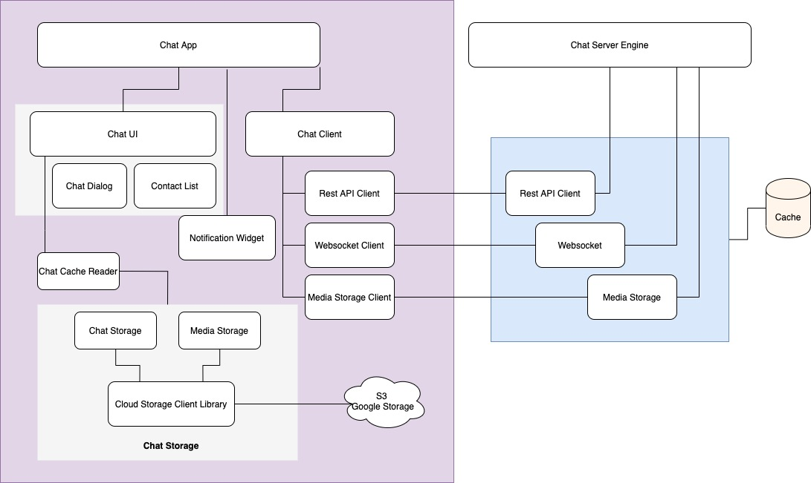

## Problem Statement
* How would you design one-on-one conversations between users?
* How would you extend your design to support group chats?
* What to do when the user is not connected to the internet?
* Delivered and read status?
* When to send push notifications?
* Can you provide end-to-end encryption. How?
* How do you backup and restore the messages when they are end-to-end encrypted?
* How do you build a platform for the community to add bots?
* How do you enable the community to build games in chatrooms?

## Basic Chat Architecture
The standard chat application has two major parts : 
- Chat Server Engine - Server which relay message from one client to other client(s).
- Client App - Application which runs on client device (mobile, desktop etc)

