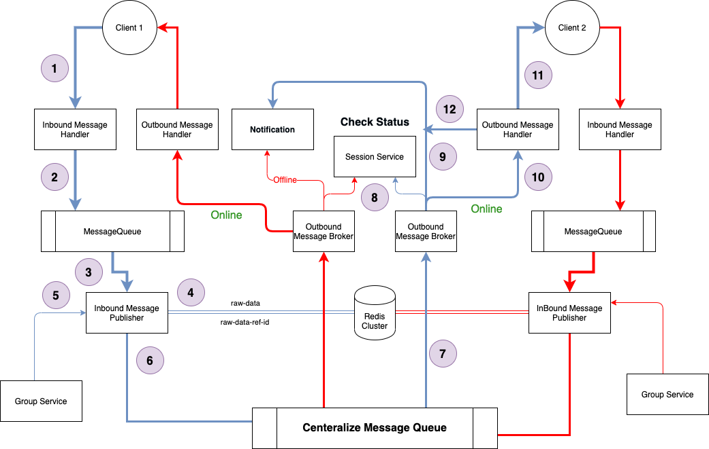

## Problem Statement
* How would you design one-on-one conversations between users?
* How would you extend your design to support group chats?
* What to do when the user is not connected to the internet?
* Delivered and read status?
* When to send push notifications?
* Can you provide end-to-end encryption. How?
* How do you backup and restore the messages when they are end-to-end encrypted?
* How do you build a platform for the community to add bots?
* How do you enable the community to build games in chatrooms?

## Basic Chat Architecture
The standard chat application has two major parts : 
- Chat Server Engine - Server which relay message from one client to other client(s).
- Client App - Application which runs on client device (mobile, desktop etc)


## Chat Server Engine

is a core of the chat architecture that handles message delivery and dispatch. 

- **Rest API Client :** 

  - It handled the tasks that are not connected directly to message dispatch and delivery, such as contact list downling, user authentication, changing of user settings, friends invitation, downloading sticker packs, etc. The Chat App (the chat client part) communicates with the Chat REST API via the **REST API Client Library**.

- **Chat WebSocket Server**

  -  It is responsible for transmitting messages between users. The Chat App communicates with the Chat WebSocket Server via the **Chat WebSocket Client Library**. This connection is open two ways; that means users don’t have to make requests to the server if there are any messages for them, they just get them right away.

- **Chat Media Storage Server** 

  - It is a pool of servers responsible for storing user media files. The files are uploaded to them via the **Chat Media Storage Client Library**.

## Chat App Design
It is the other major part of the chat architecture, the one that users directly interact with. It's split into three separate root components:

- **Chat Client Engine** 
  - It handles all of the communication with the Chat Server Engine via its internal components: Chat REST API Client Library, Chat WebSocket Client Library and Chat Media Storage Client Library. It also comprises the **Chat Push Message Handler** that deals with push notifications.
- **Chat UI** 
  - It displays data to users via its widgets: **Chat Contact List UI**, **Chat Dialog UI**.
- **Chat Device Storage** 
  - It is an internal database which stores messages and files so that users can access them offline. Its internal component, **Chat Cache Reader**, gets media files from the Chat Media Storage and stores them on the device so that the user can access them anytime without having to reach the Chat Media Storage every time.

## Chat Server Engine Design

### Authentication of User


```
var payload = {
  name: '#{customerName}',
  email: '#{customerEmail}',
  phone : '#phone_number',
  iat: #{timestamp},
  sercet_password: '#{sercet_password}'
};
```

Secret Password could be anything which can be used to authenticate user. 

Name, Email and Phone could be optional based on the way you want to authenticate the user. 

The API will return a unique **secret JWT token** which will be used to verify the user. 

**JWT Token**

When the user register/signin then we needs to generate JWT token so that user can be veirifed when we start a websocket connection with the chat server. 

**For Encryption Support:** 

Private Key and Public Certificate needs to be created at the app end when the user is singing up with the application.


### One to One and Group Chat


```
connection_detail {
 string connection_string;
 string user_token;
}
```

Depending on the server availabilty, chat client can connect to any given server.

 



- **InBoundMessageHandler**
  - It handles all the incoming messages from client and push it to the message queue. 
- **InbboundMessagePublisher**
  - In consumes messages from the queue , push it to redis first (raw data) and also gather information about the  the subsribers of the message from "GroupService" and push it to centralize message queue.
- **OutBoundMessageSubscriber**
  - Listen to all the published message events and put the message back into the message queue. 
- **OutBoundMessagehandler**
  - Publish the message back to the client.
- **Session Service**
  - Stores all the current connected users and server details.

### Understanding the architecture

0. Client establishes the connection with the server. Once Client establish connection, the conenction information will be stores in the redis cluster.

   ```
   Connected Server Details 
   Last Online Date Time
   User Identifier
   ```

- **Step 1- 2**: 
  - If client "A" sends a message to client "B". It first reaches to "InboundMessageHandler" which verifies the details of the message (not the chat text like sender & receiver information. 
  - Put  message into a queue.

- **Step 3-6** : 
  - Message is then read by consumer "InboundMessagePublisher".
  -  Message is pushed into Redis Cluster to save the data 
  - Gather related subscriber data from GroupService
  - Publish messages for subscribers to the "Centaralize Message Queue".
- **Step 7:** Subcribers get the message from "Centralize Message Queue". 
- **Step 8 - 10 ** :  
  - User session status is checked from the **SessionService**
  - If user is offline, send the notification via Google Messaging, SMS or APN
  - If user is live, the message then pass the message to Output Handler
- **Step 10-12** :
  - Read message from the OutboundMessageBroker
  - Send it to the connected client.
  - If message is not delivered or connection in closed, send it to NotificationService.

## Questions and Answer

1. **How would you design one-on-one conversations between users?**

   - As shown in the above diagram.

2. **How would you extend your design to support group chats?** 

   -  We can have a service **Group Chat Service** which will give us the list of user associated with the group. 
   - Once we receive the list of subscribed users, we can publish messages across all the users. 

3. **What to do when the user is not connected to the internet?**

   - If internet of the receiver is not connected we can push the message to redis cluster. When the user comes back online it willl fetch all the pending messages from the redis cluster. 

   - If internet of the sender is not connected, we have to cache the message on the app and send it when the user comes back online. 

4. **Delivered and read status?**

   - **Delivered Status :** 
     - Once the message is delivered - **OutboundMessageHandler** can update the  redis cluster.
   - **Read Status :** 
     - Server needs to be updated by client app with the given message id. Could be a possible overload on the system to show a read tick on client app. 

5. **When to send push notifications?**

   - If the client is not online, then only send the push notification.
   - Use session service to know of the client is online or not. 

6. **Can you provide end-to-end encryption. How?**

   - All registered users will be having their own private key saved in the app (not exposed or used during any transfer of data).
   - When you send a friend request, then public key of the request sender is used by request receiver to encrypt Session key and send back to sender. 
   - Sender decrypts the messge with private key and saves the session key in the app cache. 
   - Receiver and Sender can now use session key to encrypt and decrypt messages. 

7. **How do you backup and restore the messages when they are end-to-end encrypted?**

   - As we are keeping session key for all the conversation on the device itself, with the backup we need to backup the session key also. 

8. **How do you build a platform for the community to add bots?**

   - Bots are nothing but a user which takes actions based on the command served to them.

9. **How do you enable the community to build games in chatrooms?**

   - Games infomormation can be sent to all group members using the same infrastructure. The  difference between chat and games data would be the data (content) we are sending to other group members. 

     - When we are chating we are sending text, image etc information.
     - When we are playing games, we sent game data to group members which emebeded games app needs understand at the client end.

     

   

   

   

    